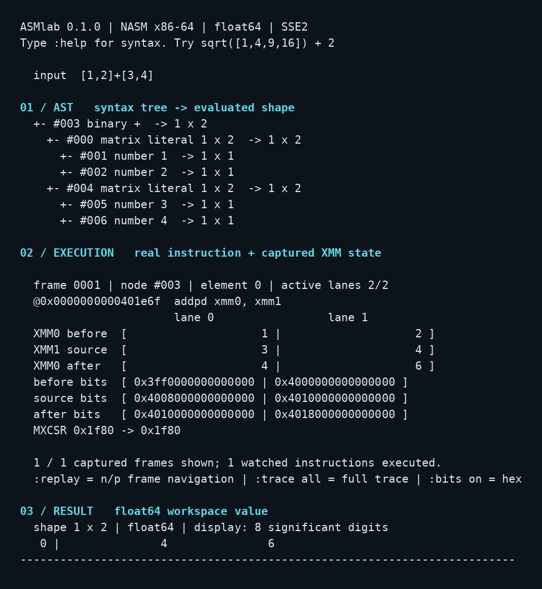

# ASMlab 0.1.0

**수식 → AST → 실제 어셈블리 명령 → SIMD 레지스터 → 계산 결과**를 살펴보는 NASM x86-64 기반 수치 계산 환경이다. 단순히 결과만 출력하는 계산기가 아니라, 어떤 구문 노드에서 어떤 명령이 실행되었고 XMM 레지스터의 각 lane이 어떻게 바뀌었는지를 보여준다.

[English](README.md) | [아키텍처](docs/ARCHITECTURE.md) | [수치 계산 범위](docs/NUMERICS.md) | [검증 보고서](docs/VERIFICATION.md)



## 먼저 확인할 검증 범위

프로그램 본체는 모두 `.asm`과 `.inc`로 작성했다. 다만 제작 환경에서 NASM을 설치할 수 없어 **NASM 자체를 사용한 네이티브 빌드 검증은 진행하지 못했다.**

동봉된 `bin/asmlab`은 NASM 소스를 검증 전용 도구로 GNU assembler의 Intel 문법으로 변환하고, GNU `as`와 GCC 링커 드라이버로 만든 실행 파일이다. 이 실행 파일로 실제 계산, 레지스터 캡처, 터미널 재생, 오류 처리 검사를 수행했다. 변환 도구가 계산을 대신하는 구조는 아니다. 실행 시 Python은 사용하지 않는다.

기본 `make`는 NASM을 직접 사용한다. NASM 빌드를 수행하도록 GitHub Actions도 구성했지만, 이번 전달 과정에서 원격 CI를 실행한 것은 아니다. 동작 검증과 NASM 빌드 검증을 같은 것으로 취급하지 않는다. 자세한 기록은 `bin/BUILD_ORIGIN.txt`와 `evidence/`에 있다.

## Level 2의 적용 범위

파서, AST, 변수 저장소, 수학 함수, 행렬 연산, 추적 기록, 터미널 UI는 모두 어셈블리로 구현했다. libc는 콘솔 입출력, 파일 입력, 문자열과 메모리 처리, 십진수 문자열의 float64 변환에만 사용한다. 따라서 libc까지 제거한 독립 실행 환경은 아니다.

`sin`, `cos`, `sqrt`, `log`, 행렬 계산을 외부 `libm`, BLAS, LAPACK 등에 위임하지 않는다. 애플리케이션 실행 경로에 C/C++/Rust/JavaScript/Python 구현은 없다. 테스트와 선택적인 검증 빌드 도구에는 개발용 Python이 들어 있으며, 프로그램 본체와 구분되어 있다.

## 실행

현재 플랫폼은 **Linux x86-64 / x86-64 Windows WSL2의 터미널**이다. Windows에서 실행할 때는 PowerShell에 ELF 파일을 직접 실행하는 것이 아니라 WSL의 Ubuntu 셸 등에서 실행해야 한다. macOS, Windows 네이티브 `.exe`, ARM 및 라즈베리파이용 실행 파일은 포함하지 않았다. 실제 검증은 Linux 컨테이너에서 수행했으며 별도 WSL 장비 검증은 하지 않았다.

동봉한 검증 실행 파일은 glibc 2.34 이상 환경에서 다음과 같이 실행한다.

```sh
cd ASMlab-v0.1.0
chmod +x bin/asmlab
./bin/asmlab
```

NASM으로 다시 빌드하려면 다음과 같이 진행한다.

```sh
sudo apt update
sudo apt install -y nasm gcc make binutils
make clean
make
./bin/asmlab --bits -e 'sqrt([1,4,9,16]) + 2'
```

GCC는 어셈블리 오브젝트와 libc의 진입 코드를 연결하는 링커 드라이버로만 사용한다. 프로젝트에 C 소스는 없다. 재생 화면은 가로 100열, 세로 42행 정도의 터미널에서 보기 편하다.

## 구현된 기능

| 구분 | 지원 내용 |
|---|---|
| 수식 | 사칙연산, 괄호, 단항 부호, 정수 지수 `^`, 우선순위 처리 |
| 데이터 | 실수 float64, 변수, 행·열벡터, 행렬, `pi`, `e`, `ans` |
| 행렬 | 덧셈·뺄셈, 스칼라 확장, 행렬 곱, 원소별 곱·나눗셈, 전치 |
| 함수 | `sin`, `cos`, `sqrt`, 자연로그 `log`, `transpose`, 전체 원소 합 `sum` |
| 시각화 | AST, 노드 번호, 계산 후 shape, 실제 실행 명령 주소, XMM0/XMM1 전후 값, 16진수 비트, MXCSR |
| 사용 방식 | REPL, 파일 실행, 단계 재생, 일반 텍스트 및 JSON 결과 출력 |
| 오류 처리 | 차원 불일치, 0 나누기, 정의역 오류, 비정상 수치, 잘못된 문법, 용량 초과 |

다음 수식을 입력하면 SIMD의 두 lane이 바뀌는 것을 확인할 수 있다.

```text
sqrt([1,4,9,16]) + 2
```

```text
sqrtpd : [1,4]  → [1,2]
sqrtpd : [9,16] → [3,4]
addpd  : [1,2] + [2,2] → [3,4]
addpd  : [3,4] + [2,2] → [5,6]
최종 결과: [3,4,5,6]
```

표시용으로 같은 수식을 다시 계산한 값이 아니다. 실제 SIMD 명령 실행 직전·직후의 레지스터 내용을 메모리에 보관한 다음 화면에 표시한다. 실제 명령 주소를 역어셈블 결과와 대조하는 검사도 포함했다.

## 단계별 재생

```text
:bits on
sqrt([1,4,9,16]) + 2
:replay
```

`n` + Enter는 다음 프레임, `p` + Enter는 이전 프레임, `q` + Enter는 재생 종료이다. Enter만 눌러도 다음 프레임으로 이동한다. `:step on`을 사용하면 이후 계산을 마칠 때마다 재생 모드로 들어간다.

**이 기능은 계산 후 캡처한 기록을 재생하는 방식이다.** 계산을 아직 하지 않은 상태에서 CPU를 한 명령씩 정지시키는 디버거가 아니며, 입력 수식을 기계어로 새로 컴파일하는 JIT도 아니다. 미리 작성된 어셈블리 커널을 AST 평가기가 호출한다. 표시하는 추적 대상은 선택한 SSE2 산술·레지스터 이동·부호 변경 명령이며, 전체 CPU 명령 스트림을 기록하지 않는다.

기본 출력은 앞의 6개 프레임이다. `:trace all`은 이후 계산에서 보관된 전체 프레임을 출력하고, `:trace on`은 6개 미리보기로 돌아간다. 한 수식당 최대 8,192개 프레임을 보관하며, 초과하면 추적 일부를 보관하지 못했다는 메시지를 표시한다. 계산 자체는 계속된다. `:trace off`도 커널 호출 비용을 제거하는 최적화 모드는 아니다.

## 문법 예제

```text
x = 3
x^2 + 4^2
A = [1,2;3,4]
B = [5,6;7,8]
A*B
A.*B
A+2
A/2
A'
transpose(A)
sin(pi/4)
log(e)
sum(A)
```

행렬의 열 구분에는 쉼표가 필요하다. `[1 2]` 대신 `[1,2]`를 사용한다. `*`는 행렬 곱 또는 스칼라 곱, `.*`는 원소별 곱이다. `/`는 오른쪽 피연산자가 스칼라인 나눗셈만 지원한다. 원소별 나눗셈은 `./`를 사용한다. `sum(A)`는 모든 원소의 합이므로 MATLAB 기본 `sum`의 열별 합과 다르다.

실패한 대입은 기존 변수와 `ans`를 변경하지 않는다. `:vars`로 변수를 보고, `:clear`로 작업 공간을 초기화하며, `:quit`으로 종료한다.

## 정밀도와 제한

데이터는 float64로 보관한다. 일반 결과 표는 8자리, 레지스터 값은 12자리의 유효숫자로 표시한다. `--quiet`와 `--json`은 17자리로 출력하고, `--bits`는 실제 64비트 표현을 보여준다.

행렬은 최대 16×16, 사용자 변수는 63개이며 별도로 `ans`가 있다. AST는 최대 512개 노드, 재귀 깊이는 최대 64이다. 행벡터와 열벡터도 이 행렬 차원 제한을 따른다. 입력 한 줄은 최대 4,095바이트다. 너무 긴 줄이나 제어 문자가 포함된 입력을 잘라서 계산하지 않고 전체 거부한다.

`sin/cos`는 라디안 입력의 절댓값이 1,000,000 이하인 범위로 제한했다. `sqrt`는 0 이상의 실수, `log`는 양의 실수만 받는다. `^`는 스칼라와 -1024~1024 범위 정수 지수만 지원하며, `0^0`은 1로 정의했다. 언더플로와 부분정규수는 허용하지만 NaN·무한대 결과는 오류다. 외부 수학 라이브러리와 동등한 전 범위 올바른 반올림을 보장하는 구현은 아니다.

역행렬, 행렬식, 선형 시스템 해법, 복소수, 심볼릭 미분·적분, 인덱싱, 그래프 플로팅, GUI, AVX2 최적화 및 MATLAB 호환 실행은 이번 버전에 포함하지 않았다.

## 검증

동봉한 실행 파일에서 **14,410개 검사 항목이 통과**했다. 이 중 `sin/cos/sqrt/log` 비교가 10,030건이며, 행렬 연산, 잘못된 입력 2,500건의 퍼징, 변수 복사·롤백, 입력 길이와 제어 문자, PTY의 다음·이전 재생, 실제 레지스터 비트와 명령 주소 대조 등을 포함한다.

```sh
# 현재 실행 파일만 검사: NASM 재빌드 없이 가능
python3 tests/verify.py bin/asmlab
sh tests/audit.sh bin/asmlab

# NASM 네이티브 빌드부터 검사: NASM이 설치되어 있어야 함
make test
```

이 검증 횟수는 모든 입력에 대한 정확성 증명이 아니다. 수치 차이의 범위, 빌드 출처, 미검증 항목은 [검증 보고서](docs/VERIFICATION.md)에 별도로 정리했다.
