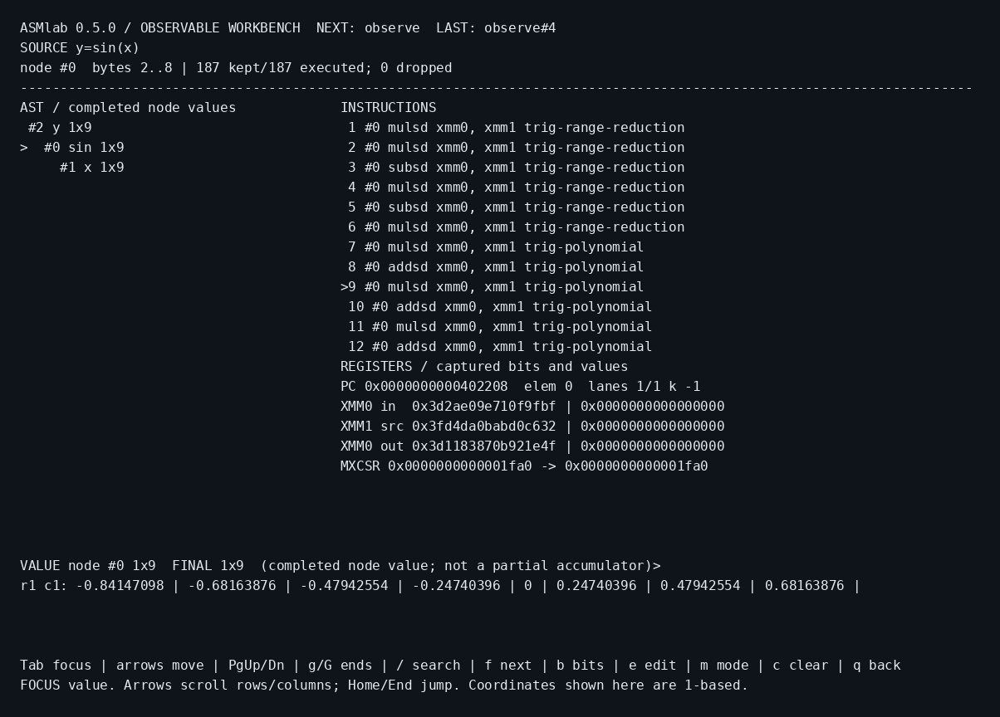

# ASMlab 0.5.0 - Observable Workbench

**Expression → AST → real assembly instructions → SIMD register state → result.** A NASM-only numerical computing application, with a native interactive terminal workbench.

[한국어](README-KR.md) · [Workbench guide (KR)](docs/OBSERVABLE-WORKBENCH-KR.md) · [Trace v2](docs/TRACE-V2.md) · [Verification](docs/VERIFICATION.md) · [Changelog](CHANGELOG.md)



## Run

```sh
chmod +x bin/asmlab bin/asmlab-debug
./bin/asmlab --workbench -e 'sqrt([1,4,9,16])+2'
./bin/asmlab --mode compute --json -e 'sum(sin(linspace(-3,3,8192)))'
./bin/asmlab --trace-json -e 'sin(pi/4)' > trace.json
```

Native Linux x86-64 static ELF; no libc, CRT, libm, BLAS, LAPACK, ncurses, Python or JavaScript at runtime. WSL2 Linux is a target, not separately tested hardware. No Windows EXE, ARM/Pi backend, web UI, server or plotting was added.

## Execution and observation

**Observe** runs actual watched SSE2 instructions and captures raw XMM/MXCSR before/after them. **Compute** is a build-time specialization of the same algorithms, using inline SSE2 with no capture/scratch or central `exec_sse` dispatch. It still parses, validates and allocates normally. This is not a JIT or a promise to outperform optimized BLAS.

Interactive/plain output defaults to Observe; JSON/quiet to Compute; `--trace-json` to Observe. Explicit `--mode` wins. `:trace off` now selects Compute; `:trace on/all` select Observe. Mode changes affect the next expression, not the identity of an existing snapshot.

Trace v2 provides escaped source text, byte spans, AST links/shapes, algorithm stages, actual instruction PC, context coordinates, active vs hardware lanes, exact register bits, MXCSR, source build ID, and honest capture counts. Only the first8192 watched instructions are retained. Compute reports an unmeasured watched count as null rather than claiming no arithmetic occurred. File output uses shell redirection; trace import/playback from files is not implemented.

## Terminal keys

The native workbench requires ANSI-compatible TTY input/output, at least80×24; painting is capped at200×64. Resize, cursor/termios restoration, shared REPL input and handled signals are supported.

| Keys | Action |
|---|---|
| Tab, arrows | Focus instructions/AST/value; navigate or scroll rows/columns |
| Enter/n/p, PgUp/PgDn, g/G | Instruction next/previous/pages/ends |
| b, /, f | Raw register bits toggle; opcode/stage substring search; next match |
| e | Edit a new expression; Enter runs, Esc cancels; arrows/Home/End/Delete/Backspace |
| Editor Up/Down, Ctrl-U | Recall up to64 source strings; clear input |
| m, c, q | Change next mode; clear workspace; exit back to classic REPL |

History stores **source only**, not old workspaces or traces. Recalling and executing a source runs it anew against current variables. Value panes show the selected node's **completed value**, not a matrix frozen halfway through computation. The classic `:replay` interface is preserved. `:workbench` opens the new UI from the classic REPL.

Signal cleanup is deferred to a UI boundary; this is not immediate in-expression cancellation. SIGKILL, external SIGSTOP, crashes or system failure cannot guarantee cleanup. ASCII editing only; no mouse or Unicode line editor. The development libc-reference build deliberately has no native workbench host.

## Numerical workspace

Dynamic dense row-major float64 arrays, deep-copy assignment and transactional variable+ans commit remain. Functions include `sin/cos/sqrt/log/sum/transpose`, `zeros/ones/eye/size/linspace`; `A(row,col)` is1-based scalar read only. No slices, indexed assignment, empty matrices, symbolic math or solver.

One value: max1,048,576 elements. Dynamic mapping budget:64MiB by default (`--memory-mib 1..1024`), including allocator metadata/temporary/staged copies but excluding static buffers/stack/whole-process RSS. AST512, recursion64, line4095bytes, decimal token127bytes, matmul16,777,216 terms. Trigonometric range and accuracy contracts are unchanged. [Language](docs/LANGUAGE.md) · [Numerics](docs/NUMERICS.md)

## Build and validate

```sh
sudo apt-get install -y nasm gcc make binutils python3
make clean
make -j2 test
make test-guards
# Without rebuilding delivered objects:
make verify
```

`make workbench-test` rebuilds the two native profiles and runs additional Observe regression, Trace v2/code inspections and controlled-PTY tests. Default app linking uses NASM+GNU ld and14 project objects. Python3.10+ is build/test infrastructure; GCC/libc are only needed for explicit development comparison targets. Native builds never silently fall back to GAS.

[Release results](evidence/release-summary.json) · [Workbench evidence](evidence/workbench/observable-workbench.json) · [ABI](docs/RUNTIME-ABI.md) · [Tool provenance](docs/TOOLCHAIN-PROVENANCE.md)

Tests ran in a local Linux x86-64 container, not remote GitHub Actions or physical WSL/Pi machines. Repeated corpus/assertion counts are not distinct mathematical examples or formal proofs. The bundled NASM toolchain provenance is documented; the tool itself is not redistributed. Verify extracted files with `sha256sum -c MANIFEST.sha256`; these hashes are not signatures.
